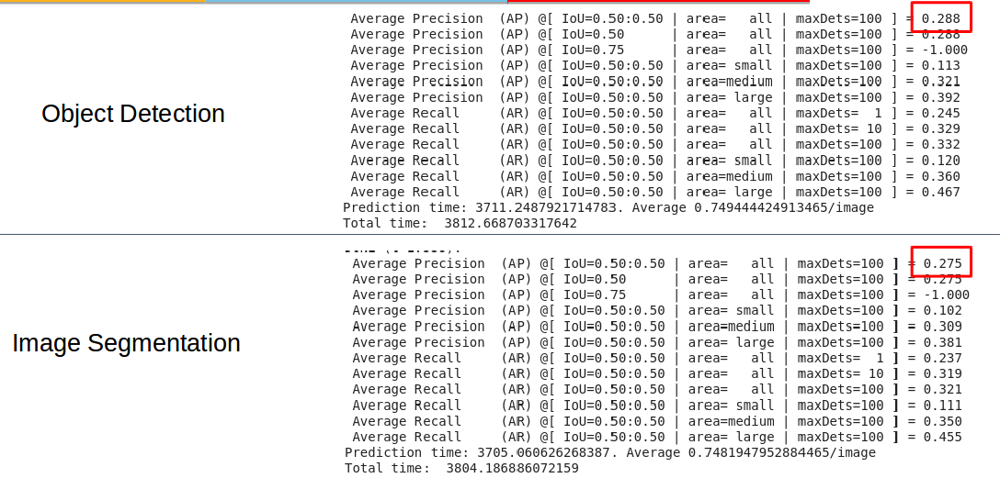
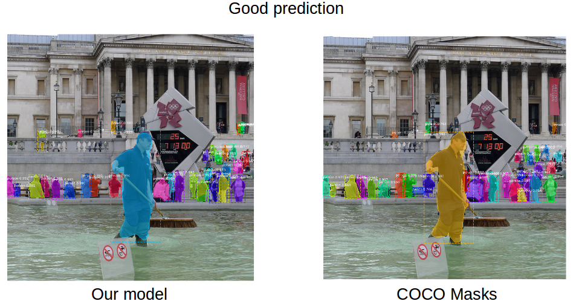
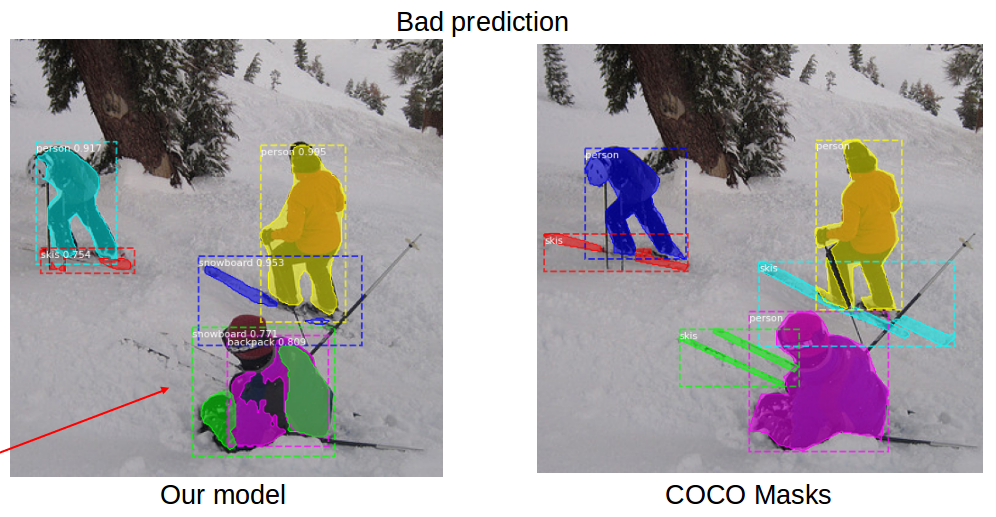
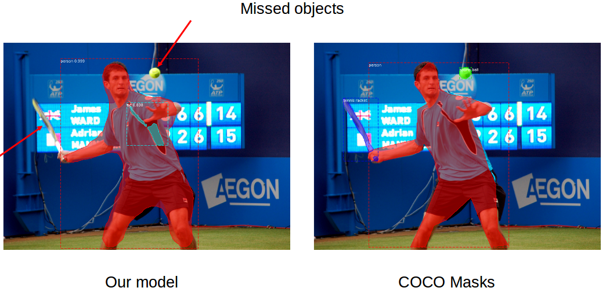
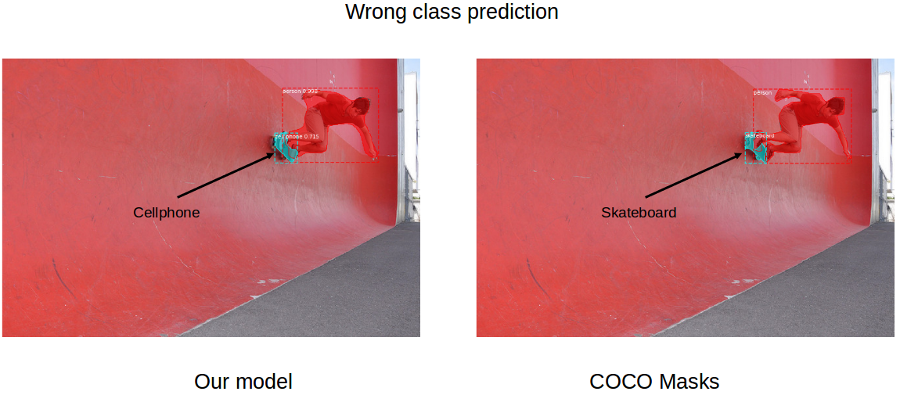
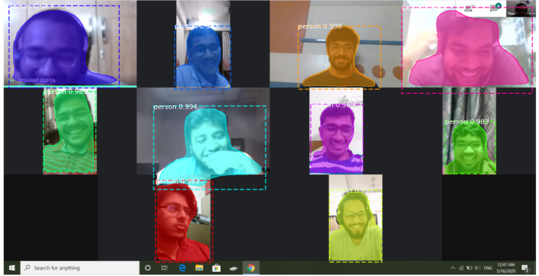

# maskrcnn-nnfl

Contributors:-
- Aatman Borda - 2017A3PS0278P
- Himank Methi - 2017A3PS0274P
- Kunal Mohta - 2017A7PS0148P

[Presentation](./presentation.pptx)

### Getting started

Clone this repository and cd into it
```
git clone https://github.com/kunal-mohta/maskrcnn-nnfl.git
cd maskrcnn-nnfl
```

Download our trained weights from the following drive link and place it in the repository at root:-
<a href="https://drive.google.com/file/d/1uxCYL8dPKNSdYuIwaD2uM4NScyDKW6Ts/view?usp=sharing" target="_blank">Trained weights</a>
(Github has 100mb limit on file size)

Create conda enviroment using the provided yaml file (no need if using Google Colab)
```
conda env create --file maskrcnn-nnfl.yml --name maskrcnn-nnfl
conda activate maskrcnn-nnfl
```

Install `pycocotools` from code present in repo (skip this if using Google Colab)
```
cd coco/PythonAPI
make
sudo make install
sudo python3 setup.py install
cd ../..
```
The above requires `Cython` to be installed. Do the following if you get an error for that
```
pip3 install --upgrade cython
```
and run the commands for installing `pycocotools` again.

**Note**: `pycocotools` package is not directly used because there are some unfixed bugs in the official package. A custom version with fixed bugs is begin used here.
But if you are using on Google Colab, it will be difficult to build this package. Instead, you could skip this with the caveat of Model Evaluation not working.


Run the main jupyter notebook
```
jupyter-notebook main.ipynb
```

Run cells in the notebook and keep following the comments in each, from the top till **Dataset download** section - including **Coco Dataset class** section.

### Run Inferences

Go to the **Inference** section.
Change weights if required, by default trained weights are used.
Run all cells that are before the next section.

### Run Training

Go to the **Dataset download** section.
Run the cells starting from this section and keep reading the comments for details. Run all cells till the **Training** section.

We have done training in 3 stages - training the head layers, 4+ ResNet layers, and then all layers. Code for this training schedule is present in the **Training** section. Change this as per your requirement.

### Run Evaluation

**Note**:
- This only works if you installed the custom `pycocotools` package (see above).
- This also requires the validation dataset to be downloaded, unless if you just want to test the code and are using the provided smaller dataset.

Go to the **Evaluation** section and run all cells.

### Quantitative Results

- Mean Average Precision for **Object Detection** = **0.288** (0.382 in Mask-RCNN paper)
- Mean Average Precision for **Image Segmentation** = **0.275** (0.357 in Mask-RCNN paper)

<center>

</center>

### Qualitative Results

<center>

<hr/>

<hr/>

<hr/>

<hr/>

#### Custom Image

</center>